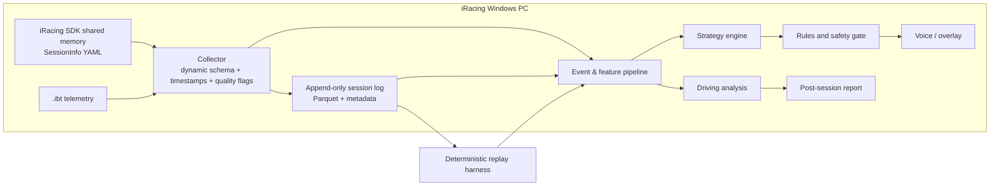

# Technical Architecture

## 1. System overview



The MVP should use Python 3.12. A Windows collector can start with `pyirsdk`, the data layer with Polars / Arrow / Parquet, numerical work with NumPy / SciPy, and a local API with FastAPI. If measurement reveals collector jitter or packaging problems, replace only the collector with .NET without changing the domain model or log protocol.

## 2. Why a local Windows sidecar

iRacing's live SDK and REST `/data` API are separate systems:

- Live telemetry comes from Windows shared memory, usually at 60 Hz, with lower-frequency SessionInfo YAML updates.
- `.ibt` is a high-density post-session telemetry file.
- The `/data` API is for historical results, member data, and events; it does not belong in the real-time decision path.
- A UI can be displayed on another Mac, tablet, or browser through a local WebSocket, but the collector must run close to the simulator.

At startup the collector reads variable headers, units, array lengths, and tick rate. Variable sets differ by car, build, and session; never hard-code the assumption that every car exposes the same fields.

## 3. Data rates and process isolation

- Raw telemetry: preserve the SDK's actual tick rate.
- Driving features: retain raw input and resample during analysis on a 0.5–1 meter spatial grid.
- Strategy state: usually update at 10 Hz.
- Full candidate strategy: recompute at 1–2 Hz, immediately on flag, pit, or session-state transitions.
- Speech scheduling: event-driven.

Keep collection, strategy, and UI isolated at least logically. A model, LLM, TTS, or report failure must not slow iRacing or drop raw data.

## 4. Normalized data model

```text
TelemetrySample {
  session_id, sim_build, source_mode, tick, session_time_s, monotonic_time_ns,
  field_presence_mask, dropped_ticks, source_stale,

  track_id, track_config, track_length_m,
  lap, lap_completed, lap_dist_pct,
  speed_mps, throttle, brake, clutch, steer_rad, gear, rpm,
  accel_long_mps2, accel_lat_mps2, yaw_rad, yaw_rate_rps,
  fuel_l, fuel_pct,
  player_surface, surface_material,
  on_pit_road, in_pit_stall, pit_service_state,
  flags, pits_open, wetness, track_temp_c, air_temp_c,

  optional_vehicle_channels,
  opponents[]
}
```

Derived entities:

- `LapObservation`
- `CornerLapFeature`
- `Stint`
- `PitEvent`
- `RaceControlState`
- `ModelBelief`
- `CandidatePlan`
- `Recommendation`
- `AlertEvent`

Every derived value records `source`, `observed_at`, `confidence`, `model_version`, and input evidence IDs.

## 5. Tire semantics

The F6 display reports the previous removed tire set; tire temperature and wear are updated at pit stops. The data layer must preserve:

```text
tire_measurement {
  measured_at_pit,
  removed_stint_id,
  wear_lmr[4],
  temp_lmr[4],
  snapshot_age_laps
}
```

The current stint uses two separate models:

1. **Performance degradation**: estimate online from condition-adjusted lap-time residuals.
2. **Physical wear belief**: build a latent-state distribution from lap count, driving-load proxies, environment, and historical pit measurements.

The product must not substitute a physical-wear model for a real sensor measurement. Recalibrate after each delayed pit measurement while retaining prediction error.

## 6. Fuel model

For a lap not contaminated by a pit stop:

\[
c_l = F_{l,start} - F_{l,end}
\]

Use robust Huber or Student-t online regression so yellow flags, spins, tows, and abnormal laps do not corrupt the estimate. Features may include push/fuel-saving mode, yellow fraction, throttle and lift, traffic/draft, dry/wet state, and damage proxies.

Sample total demand for each future scenario:

\[
F_{need}^{(\omega)} = \sum_h c_h^{(\omega)} d_h + R
\]

Choose a high fuel quantile:

\[
F_{fill}=\max\left(0,Q_{1-\alpha}(F_{need})-\hat F_{at\ box}\right)
\]

A time-limited race must explicitly simulate the leader's future crossings and the “possibly one more lap” branch; `remaining_time / average_lap_time` alone is not sufficient.

## 7. Strategy optimization

Candidate actions include:

- candidate pit laps from now through fuel-latest;
- fuel-to-end, splash, and full-fuel plans;
- no tires, tire change, and legal compounds;
- allowed repair options;
- one-stop and multi-stop plans.

Service time comes from a versioned rules profile. Since Season 3 2026, different events may use different pit-service rules: the default may fuel before tires, IMSA may service simultaneously, and NEC may service simultaneously with slower fueling. A single fixed pit-stop constant cannot cover every event.

The MVP first filters infeasible plans and plans with excessive fuel-out risk, then minimizes:

\[
J(a)=E[T_{finish}]+\lambda\,CVaR_{95}(T_{finish})
\]

Change the recommendation only when the new plan clears a hysteresis threshold and has enough probability of winning.

## 8. Opponents and traffic

Opponents expose only relatively sparse `CarIdx*` state, not complete Brake/Throttle or true fuel. The system needs to:

- unwrap lap plus lap distance to maintain total-field distance;
- distinguish normal stops, damage repairs, disconnects, and driver swaps;
- learn pit hazard for a car, class, or event from completed stints;
- predict exit time and position for each candidate pit;
- estimate nearby cars, pack density, class, and relative speed;
- include traffic loss in candidate plans.

Opponent output must use probability language, such as “Car 23 has an estimated 65% chance of pitting within the next two laps.”

## 9. Track-space and corner detection

1. Unwrap `LapDistPct` and multiply by `TrackLength` to obtain standard track coordinate `s`.
2. Remove reverse travel, resets, pit laps, incidents, yellow flags, and obvious traffic laps.
3. Monotonically interpolate cumulative time and input channels onto a 0.5–1 meter grid.
4. Learn a curvature template from multi-lap `yaw_rate / speed`, steering, and lateral acceleration.
5. Detect corner regions with dual thresholds and hysteresis; allow chicanes, linked corners, and multi-apex complexes.
6. Detect brake onset, turn-in, apex, brake release, throttle pickup, and exit separately for each lap.

Define time loss as:

\[
\Delta t(s)=t_{user}(s)-t_{ref}(s)
\]

The local increment is:

\[
\frac{d\Delta t}{ds}=\frac{1}{v_{user}}-\frac{1}{v_{ref}}
\]

Count each corner's local loss and exit carry loss once. The sum of all windows must close to the actual lap-time difference.

## 10. Lines and curbs

`LapDistPct` is good for alignment but cannot determine lateral vehicle position. The line module must reconstruct a relative 2D loop from world direction and velocity, then perform loop closure and multi-lap alignment. Disable line advice when quality is below the gate.

Curb contact requires a combination of:

- four-wheel rumble channels;
- surface material;
- vertical acceleration and shock spikes;
- incident/off-track state;
- yaw stability and whether a second lift occurs.

Recommend testing more curb only when repeated condition-matched laps from the driver support it.

## 11. LLM boundary

Allowed:

- Turn a structured Recommendation into natural, short speech.
- Answer “why pit now?” using numbers from candidate plans.
- Summarize the top three post-session opportunities and practice plan.
- Adjust wording and speech density to user preferences.

Forbidden:

- Read raw 60 Hz data and calculate independently.
- Add numbers not produced by the model.
- Override fuel, pit-open, rules, or stale-data safety gates.
- Block the real-time path.
- Present an inference as a measurement.

The first version can use only phrase templates; connect an LLM after the core system is validated.

## 12. Safety and rules

- Do not automate steering, throttle, brake, clutch, or shifting. Sporting Code 8.1.1.2 prohibits third-party modification or automation of real-time driver inputs.
- Read only the public iRacing SDK; do not inject processes, hook, sniff packets, or bypass hidden state.
- If pit service settings are ever automated, use only official pit macros / SDK pit commands with separate opt-in, read-back confirmation, and a fast disable path.
- When the rules profile is unknown, pits are closed, data is stale, the session resets, or the CarIdx map changes unexpectedly, enter a degraded state and do not issue a deterministic tactical command.
- Official-race speech is enabled only after shadow, Hosted, or AI-session validation.

## 13. Replay-first test architecture

Every live input must be saved as an immutable session log and replayed tick by tick through the same adapter. Test layers:

1. Unit tests: lap wrap, fuel jumps, pit events, flags, and the last lap of a time-limited race.
2. Property tests: increasing reserve never lowers recommended fuel; closed pits never produce a legal box command; stale data never emits a new tactical recommendation.
3. Synthetic discrete-event simulation: fuel, tire cliffs, opponent strategy, traffic, yellow flags, weather, and sensor dropout.
4. Frozen real `.ibt` regression set.
5. Historical replay in shadow mode.
6. Forward validation in AI/Hosted sessions.
7. Official-race speech only after all preceding gates pass.

## 14. Still requiring field validation

- Variable inventory for the target car and current sim build;
- exact refresh behavior of SDK tire fields in Test, Hosted, and Official sessions;
- behavior of `irsdkLogAllCars=1` for live shared memory and fields with more than 64 cars;
- CarIdx, driver, and team mapping after a driver swap;
- pit-command write, read-back, and failure state;
- stable mapping from event rules identifiers to rules profiles;
- curb-channel reliability for the target car and track.

## 15. References

- [iRacing distinction between local SDK and `/data` API](https://support.iracing.com/support/solutions/articles/31000177790-oauth-client-credentials)
- [iRacing telemetry and `.ibt` quick start](https://ir-core-sites.iracing.com/dev/atlas/atlas_quickstart.pdf)
- [iRacing F6 tire-information refresh behavior](https://support.iracing.com/support/solutions/articles/31000167257-black-box-screen-information-and-controls)
- [Season 3 2026 Track Map, Fuel Calculator, and event-specific pit rules](https://support.iracing.com/support/solutions/articles/31000179016-2026-season-3-initial-release-notes-2026-06-09-01-)
- [Season 3 Patch 1 all-car `CarIdx` logging option](https://support.iracing.com/support/solutions/articles/31000179039-2026-season-3-patch-1-release-notes-2026-06-12-02-)
- [Sporting Code dated 2026-03-10](https://ir-core-sites.iracing.com/members/pdfs/20260310-official_sporting_code_dated_Mar_10_2026.pdf)
- [Official pit macro commands](https://support.iracing.com/support/solutions/articles/31000170165-pit-macros-chat-commands)
